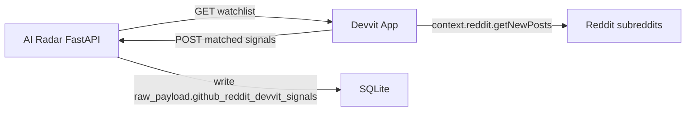

# Reddit Devvit 社区信号采集方案

目标：用 Reddit Devvit 代替传统个人 API key。Devvit app 在 Reddit 平台内运行，启用 `reddit` permission 后由 Devvit 处理 Reddit 侧认证；它把命中的帖子通过 HTTP 回传到本项目 FastAPI。

## 架构



## 本项目新增接口

### 1. Watchlist

```http
GET /api/integrations/reddit-devvit/watchlist
Authorization: Bearer <REDDIT_DEVVIT_SHARED_TOKEN>
```

返回最近 GitHub 项目的关键词、repo URL、别名：

```json
{
  "status": "success",
  "version": "reddit_devvit_watchlist_v1",
  "items": [
    {
      "source_item_id": 451,
      "project_key": "pbakaus/impeccable",
      "repo_url": "https://github.com/pbakaus/impeccable",
      "aliases": ["pbakaus/impeccable", "https://github.com/pbakaus/impeccable"]
    }
  ]
}
```

### 2. Signal ingest

```http
POST /api/integrations/reddit-devvit/signals
Authorization: Bearer <REDDIT_DEVVIT_SHARED_TOKEN>
```

Devvit 回传：

```json
{
  "source": "reddit_devvit_collector",
  "signals": [
    {
      "source_item_id": 451,
      "platform": "Reddit",
      "source_type": "post_devvit",
      "url": "https://www.reddit.com/comments/...",
      "title": "帖子标题",
      "quote_or_excerpt": "正文摘录",
      "relevance_reason": "命中项目关键词"
    }
  ]
}
```

后端写入：

- `raw_payload_json.github_reddit_devvit_signals`
- 如果已有 `github_community_signals`，同步合并到：
  - `github_community_signals.platforms.reddit_devvit`
  - `github_community_signals.signals`

## Devvit app 目录

```text
integrations/reddit-devvit-collector/
  devvit.json
  package.json
  tsconfig.json
  src/main.ts
```

核心逻辑：

1. 从 AI Radar 拉 watchlist；
2. 扫描配置的 subreddit 新帖；
3. 用 watchlist 关键词本地匹配；
4. 命中后 POST 回 AI Radar。

## 配置

本项目 `.env`：

```env
REDDIT_DEVVIT_SHARED_TOKEN=一段随机长 token
REDDIT_DEVVIT_WATCHLIST_LIMIT=50
```

Devvit app settings：

- `aiRadarBaseUrl`：公网可访问的 AI Radar 地址，例如 `http://47.250.164.154:2050`
- `sharedToken`：同 `REDDIT_DEVVIT_SHARED_TOKEN`
- `subreddits`：逗号分隔，例如 `programming,webdev,LocalLLaMA,SideProject`
- `postLimitPerSubreddit`：每个 subreddit 拉取的新帖数量

注意：Devvit 云端无法访问 `127.0.0.1`，本地调试需要 ngrok / cloudflared / VPS 反代。你当前计划使用 `47.250.164.154:2050`。

## Devvit 权限

`integrations/reddit-devvit-collector/devvit.json` 中需要：

```json
{
  "permissions": {
    "reddit": true,
    "http": {
      "domains": ["47.250.164.154:2050"]
    }
  }
}
```

如果 Devvit 上传时要求 HTTPS 或域名而不是裸 IP，需要给 `47.250.164.154:2050` 配反代和 TLS，或绑定一个域名后更新这里。

## 局限

- 当前实现是“扫描指定 subreddit 新帖”，不是全 Reddit 全局搜索。
- 优点是不用传统个人 Reddit API key，认证由 Devvit 处理。
- 缺点是需要把 Devvit app 安装/运行在 Reddit 平台内，并把 AI Radar 暴露为公网回调地址。
